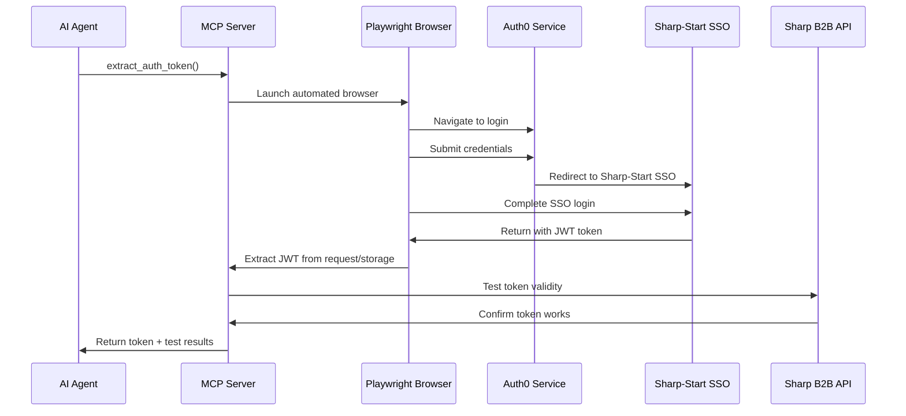

# MCP-RMM API Documentation

## Overview

This document provides detailed API documentation for the MCP-RMM (Model Context Protocol - Remote Management Module) server. The server provides AI agents with comprehensive device management capabilities for Sharp MFP devices through automated authentication and RESTful API integration.

## Table of Contents

1. [Authentication](#authentication)
2. [Core API Tools](#core-api-tools)
3. [Data Models](#data-models)
4. [Error Handling](#error-handling)
5. [Usage Examples](#usage-examples)
6. [Rate Limiting](#rate-limiting)

## Authentication

### JWT Token Management

The system uses JWT tokens extracted from Auth0 authentication flow. Tokens are automatically managed with validation and refresh capabilities.

#### Token Extraction Flow



## Core API Tools

### 1. Authentication Tools

#### `extract_auth_token()`

Extracts JWT token from Auth0 authentication using Playwright automation.

**Parameters:** None

**Returns:**

```json
{
  "success": boolean,
  "token": "string (JWT)",
  "message": "string",
  "retrieved_at": "string (ISO 8601)"
}
```

**Success Response:**

```json
{
  "success": true,
  "token": "eyJhbGciOiJSUzI1NiIsInR5cCI6IkpXVCJ9...",
  "message": "Token extraction completed successfully",
  "retrieved_at": "2025-08-11T10:30:00.000Z"
}
```

**Error Response:**

```json
{
  "success": false,
  "error": "Auth0 login failed",
  "extracted_at": "2025-08-11T10:30:00.000Z"
}
```

### 2. Device Management Tools

#### `list_devices(group_id?, page_size?, start_index?)`

Retrieve all managed devices with their current firmware status.

**Parameters:**

- `group_id` (optional): Filter by specific group ID. If not provided, extracts from JWT token
- `page_size` (optional): Number of devices to return (default: 25, max: 100)
- `start_index` (optional): Starting index for pagination (default: 0)

**Returns:**

```json
{
  "success": boolean,
  "summary": {
    "total_devices": number,
    "returned_count": number,
    "devices_needing_update": number,
    "start_index": number,
    "page_size": number,
    "group_id": "string",
    "group_id_source": "jwt_token|parameter_or_fallback"
  },
  "devices": [DeviceInfo],
  "raw_response": object,
  "retrieved_at": "string (ISO 8601)"
}
```

**Device Info Model:**

```json
{
  "device_id": "mn=<base64>:sn=<base64>",
  "model_name": "string",
  "serial_number": "string",
  "ip_address": "string",
  "friendly_name": "string",
  "current_firmware": "string",
  "latest_firmware": "string",
  "needs_update": boolean,
  "update_status": "string",
  "ota_mode": "auto|confirmation|off",
  "ota_setting_status": "string",
  "ota_window": {
    "start_hour": "string",
    "end_hour": "string"
  }
}
```

#### `make_api_request(endpoint?, method?, payload?)`

Make direct API calls to Sharp B2B Cloud endpoints.

**Parameters:**

- `endpoint` (optional): API endpoint path (default: "/rmm/fss/fwupd/getFirmwareUpdateList")
- `method` (optional): HTTP method (default: "GET")
- `payload` (optional): Request payload for POST/PUT requests

**Returns:**

```json
{
  "success": boolean,
  "status_code": number,
  "response_data": object,
  "endpoint": "string",
  "method": "string",
  "requested_at": "string (ISO 8601)"
}
```

### 3. Firmware Management Tools

#### `list_staged_firmware(group_id?, start_index?, count?)`

Show all available staged firmware files for Sharp MFP devices.

**Parameters:**

- `group_id` (optional): Group ID to filter firmware files
- `start_index` (optional): Pagination start index (default: 0)
- `count` (optional): Number of firmware files to return (default: 100, max: 100)

**Returns:**

```json
{
  "success": boolean,
  "summary": {
    "total_files": number,
    "returned_count": number,
    "group_id": "string",
    "start_index": number,
    "count": number
  },
  "firmware_files": [FirmwareFile],
  "raw_response": object,
  "retrieved_at": "string (ISO 8601)"
}
```

**Firmware File Model:**

```json
{
  "file_id": "string (UUID)",
  "title": "string",
  "filename": "string",
  "size_bytes": number,
  "uploaded_at": "string (ISO 8601)"
}
```

#### `schedule_firmware_update(device_ids, firmware_file_id, transfer_datetime, execute_datetime, timezone?, group_id?)`

Schedule firmware updates for specific devices.

**Parameters:**

- `device_ids` (required): Array of target device IDs
- `firmware_file_id` (required): UUID of staged firmware file
- `transfer_datetime` (required): Unix timestamp in milliseconds when to transfer firmware
- `execute_datetime` (required): When to execute update (format: "YYYYMMDDHHMM")
- `timezone` (optional): Timezone for transfer (default: "UTC+05:30")
- `group_id` (optional): Group ID

**Parameter Validation:**

- Device IDs must match pattern: `^mn=[A-Za-z0-9+/=]+:sn=[A-Za-z0-9+/=]+$`
- Firmware file ID must be valid UUID format
- Execute datetime must match pattern: `^\d{12}$`
- Transfer datetime must be in the future

**Returns:**

```json
{
  "success": boolean,
  "message": "string",
  "schedule": {
    "scheduled_devices": number,
    "device_ids": ["string"],
    "firmware_file_id": "string",
    "transfer_schedule": {
      "timestamp": number,
      "datetime": "string (ISO 8601)",
      "timezone": "string"
    },
    "execute_schedule": {
      "datetime_string": "string",
      "formatted": "string"
    },
    "group_id": "string",
    "group_id_source": "string"
  },
  "raw_response": object,
  "scheduled_at": "string (ISO 8601)"
}
```

#### `cancel_scheduled_update(device_ids, group_id?)`

Cancel scheduled firmware updates for specific devices.

**Parameters:**

- `device_ids` (required): Array of target device IDs to cancel updates for
- `group_id` (optional): Group ID

**Returns:**

```json
{
  "success": boolean,
  "message": "string",
  "cancellation": {
    "cancelled_devices": number,
    "device_ids": ["string"],
    "group_id": "string",
    "group_id_source": "string"
  },
  "raw_response": object,
  "cancelled_at": "string (ISO 8601)"
}
```

### 4. OTA Configuration Tools

#### `configure_ota_mode(device_ids, ota_mode, start_hour?, end_hour?, group_id?)`

Configure OTA (Over-The-Air) update mode and schedule for devices.

**Parameters:**

- `device_ids` (required): Array of target device IDs
- `ota_mode` (required): "auto", "confirmation", or "off"
- `start_hour` (optional): Update window start time (0-23 or -1 for 24hrs, default: 2)
- `end_hour` (optional): Update window end time (0-23 or -1 for 24hrs, default: 4)
- `group_id` (optional): Group ID

**OTA Mode Values:**

- `"auto"`: Automatically install updates during specified window
- `"confirmation"`: Require user confirmation before installing
- `"off"`: Disable automatic updates

**Time Window Rules:**

- Values 0-23: Specific hour (24-hour format)
- Value -1: 24-hour availability
- For "auto" mode: start_hour must be less than end_hour (unless using -1)

**Returns:**

```json
{
  "success": boolean,
  "message": "string",
  "configuration": {
    "configured_devices": number,
    "device_ids": ["string"],
    "ota_mode": "string",
    "update_window": {
      "start_hour": number,
      "end_hour": number,
      "description": "string"
    },
    "group_id": "string",
    "group_id_source": "string"
  },
  "raw_response": object,
  "configured_at": "string (ISO 8601)"
}
```

## Data Models

### Device ID Format

Device IDs use a specific base64-encoded format:

```
mn=<base64_model>:sn=<base64_serial>
```

**Example:**

```
mn=U2hhcnA=:sn=MTIzNDU2Nzg=
```

Where:

- `U2hhcnA=` decodes to "Sharp"
- `MTIzNDU2Nzg=` decodes to "12345678"

### DateTime Formats

**ISO 8601 Timestamps:**

```
2025-08-11T10:30:00.000Z
```

**Execute DateTime Format:**

```
YYYYMMDDHHMM
```

Example: `202508111400` = August 11, 2025 at 14:00

**Unix Timestamps:**

- Used for transfer_datetime
- Must be in milliseconds
- Example: `1692012000000`

### Error Response Format

All API calls can return error responses in this format:

```json
{
  "success": false,
  "error": "string (error message)",
  "error_details": ["string"] // optional array of detailed errors
}
```

## Error Handling

### Common Error Types

#### Authentication Errors

```json
{
  "success": false,
  "error": "No valid token found or failed to extract token"
}
```

#### Validation Errors

```json
{
  "success": false,
  "error": "Invalid device ID format: ['invalid-id']. Expected format: 'mn=<base64>:sn=<base64>'"
}
```

#### API Errors

```json
{
  "success": false,
  "error": "API returned errors",
  "error_details": [
    {
      "code": "DEVICE_NOT_FOUND",
      "message": "Device not found in group"
    }
  ]
}
```

### HTTP Status Code Mapping

- `200`: Success
- `401`: Authentication failed
- `403`: Insufficient permissions
- `404`: Resource not found
- `422`: Validation error
- `500`: Internal server error

## Usage Examples

### Complete Workflow Example

```python
# 1. Extract authentication token (if needed)
token_result = await extract_auth_token()
if not token_result["success"]:
    print(f"Authentication failed: {token_result['error']}")
    return

# 2. List all devices
devices_result = await list_devices(page_size=50)
if devices_result["success"]:
    devices = devices_result["devices"]
    print(f"Found {len(devices)} devices")

    # Find devices needing updates
    update_needed = [d for d in devices if d["needs_update"]]
    print(f"{len(update_needed)} devices need firmware updates")

# 3. Configure OTA mode for devices needing updates
for device in update_needed[:5]:  # Configure first 5 devices
    config_result = await configure_ota_mode(
        device_ids=[device["device_id"]],
        ota_mode="auto",
        start_hour=2,   # 2 AM
        end_hour=6      # 6 AM
    )
    if config_result["success"]:
        print(f"Configured OTA for {device['model_name']}")

# 4. List available firmware
firmware_result = await list_staged_firmware()
if firmware_result["success"] and firmware_result["firmware_files"]:
    latest_firmware = firmware_result["firmware_files"][0]

    # 5. Schedule firmware update
    import time
    transfer_time = int((time.time() + 3600) * 1000)  # 1 hour from now

    schedule_result = await schedule_firmware_update(
        device_ids=[d["device_id"] for d in update_needed[:3]],
        firmware_file_id=latest_firmware["file_id"],
        transfer_datetime=transfer_time,
        execute_datetime="202508120200"  # Tomorrow at 2 AM
    )

    if schedule_result["success"]:
        print("Firmware update scheduled successfully")
```

### Error Handling Example

```python
async def safe_device_operation():
    try:
        # Attempt to list devices
        result = await list_devices()

        if result["success"]:
            return result["devices"]
        else:
            # Handle known API errors
            error_msg = result.get("error", "Unknown error")
            if "token" in error_msg.lower():
                # Token issue - try to refresh
                print("Token issue detected, refreshing...")
                await extract_auth_token()
                # Retry operation
                return await list_devices()
            else:
                print(f"API error: {error_msg}")
                return []

    except Exception as e:
        print(f"Unexpected error: {e}")
        return []
```

### Batch Operations Example

```python
async def batch_configure_devices(device_list, ota_mode="auto"):
    """Configure OTA mode for multiple devices in batches."""
    batch_size = 10
    results = []

    for i in range(0, len(device_list), batch_size):
        batch = device_list[i:i + batch_size]
        device_ids = [d["device_id"] for d in batch]

        result = await configure_ota_mode(
            device_ids=device_ids,
            ota_mode=ota_mode,
            start_hour=2,
            end_hour=6
        )

        results.append({
            "batch": i // batch_size + 1,
            "devices": len(device_ids),
            "success": result["success"],
            "error": result.get("error")
        })

        # Add delay between batches to avoid rate limiting
        await asyncio.sleep(1)

    return results
```

## Rate Limiting

### API Rate Limits

The Sharp B2B Cloud API has the following rate limits:

- **Authentication**: 10 requests per minute
- **Device Operations**: 100 requests per minute
- **Firmware Operations**: 50 requests per minute

### Best Practices

1. **Batch Operations**: Group multiple devices in single API calls
2. **Caching**: Store device information locally to reduce API calls
3. **Token Reuse**: Validate existing tokens before extracting new ones
4. **Error Handling**: Implement exponential backoff for rate limit errors

### Rate Limit Headers

Monitor these response headers:

- `X-RateLimit-Remaining`: Requests remaining in current window
- `X-RateLimit-Reset`: Time when rate limit resets
- `Retry-After`: Seconds to wait before retrying (on 429 errors)

## Resources

### MCP Resource: Token File

The server provides access to the token file as an MCP resource:

**URI:** `file://auth_token.json`

**Content:** Current token data including:

- Token extraction results
- API test results
- Recent API call history

### Monitoring & Debugging

The system maintains comprehensive logs in the token file:

```json
{
  "token_extraction": {
    "success": true,
    "token": "eyJ...",
    "source": "api_request_interception",
    "extracted_at": "2025-08-11T10:30:00Z"
  },
  "api_test": {
    "success": true,
    "status_code": 200,
    "tested_at": "2025-08-11T10:30:15Z"
  },
  "api_calls": [
    {
      "endpoint": "/rmm/fss/fwupd/getFirmwareUpdateList",
      "method": "POST",
      "status_code": 200,
      "requested_at": "2025-08-11T10:31:00Z"
    }
  ]
}
```

Use this data for:

- Debugging authentication issues
- Monitoring API usage
- Tracking device operation history
