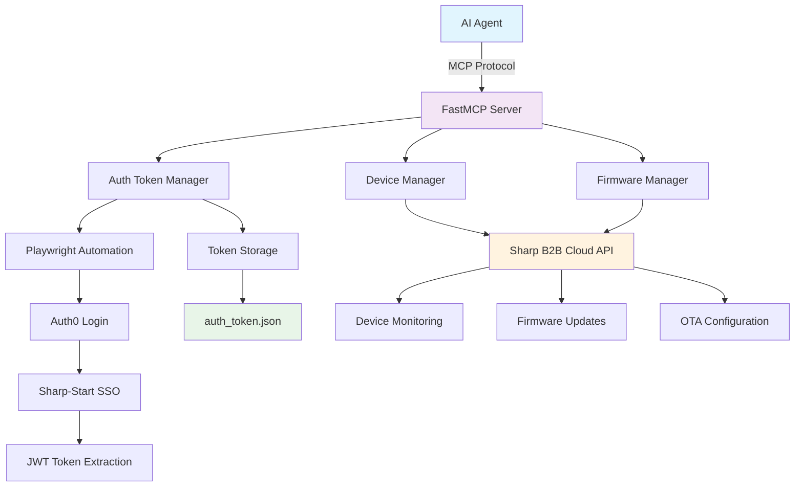

# MCP-RMM: Auth0 JWT Token Manager for AI Agents

[](https://www.python.org/)
[](https://github.com/jlowin/fastmcp)
[](https://playwright.dev/)

> **MCP Remote Management Module** - A sophisticated AI-powered firmware management system that automates Auth0 JWT token extraction and provides comprehensive device management capabilities for Sharp MFP devices.

## 🌟 Overview

MCP-RMM is an advanced **Model Context Protocol (MCP) server** designed for **AI-based firmware upgradation systems**. It provides seamless authentication management, device monitoring, and automated firmware update scheduling for Sharp Multi-Function Printer (MFP) devices.

### Key Features

- 🔐 **Automated Auth0 JWT Token Management** - Browser automation for seamless authentication
- 🤖 **AI Agent Integration** - Built with FastMCP 2.0 for AI model connectivity
- 📱 **Device Management** - Comprehensive device listing, monitoring, and control
- 🔄 **Firmware Update Automation** - Schedule, monitor, and manage firmware updates
- 🌐 **RESTful API Integration** - Direct Sharp B2B Cloud API connectivity
- 🔧 **OTA Configuration** - Over-the-air update preferences and scheduling
- 📊 **Real-time Monitoring** - Device status tracking and update progress
- 🛡️ **Secure Token Storage** - JWT token validation and automatic refresh

## 🏗️ Architecture



## 🚀 Quick Start

### Prerequisites

- **Python 3.11+** installed
- **uv** package manager (recommended) or pip
- **Playwright browsers** installed
- **Sharp B2B Cloud account** with appropriate permissions
- **Environment variables** configured

### 1. Clone & Setup

```powershell
# Clone the repository
git clone https://github.com/anupam-123/rmm_server.git
cd rmm_server

# Install dependencies using uv (recommended)
uv sync

# OR using pip
pip install -e .
```

### 2. Environment Configuration

Create a `.env` file in the project root:

```env
# Auth0 Configuration
AUTH0_LOGIN_URL=https://your-auth0-domain.auth0.com/login
USERNAME_1=your-username@example.com
PASSWORD_1=your-secure-password

# API Configuration
API_BASE_URL=https://alt-rmm-api.sharpb2bcloud.com
TENANT_LIST_ENDPOINT=api/v1/tenants
OCP_APIM_SUBSCRIPTION_KEY=your-subscription-key

# Browser Automation Settings
HEADLESS=false
SLOW_MO=1500
VIEWPORT_WIDTH=1920
VIEWPORT_HEIGHT=1080

# Timeouts (milliseconds)
DASHBOARD_TIMEOUT=40000
ELEMENT_TIMEOUT=40000
API_TRIGGER_TIMEOUT=40000

# Storage
TOKEN_FILE=auth_token.json
```

### 3. Install Playwright Browsers

```powershell
# Install required browsers
uv run playwright install firefox

# OR if using pip
playwright install firefox
```

### 4. Run the Server

```powershell
# Method 1: Using uv
uv run python server.py

# Method 2: Using uvicorn directly
uv run uvicorn auth_mcp_server:mcp --host 0.0.0.0 --port 8000

# Method 3: Using the package script
uv run mcp-rmm
```

The server will start on `http://localhost:8000`

## 🔧 Configuration

### Environment Variables Reference

| Variable                    | Description                   | Default           | Required |
| --------------------------- | ----------------------------- | ----------------- | -------- |
| `AUTH0_LOGIN_URL`           | Auth0 authentication endpoint | -                 | ✅       |
| `USERNAME_1`                | Login username/email          | -                 | ✅       |
| `PASSWORD_1`                | Login password                | -                 | ✅       |
| `API_BASE_URL`              | Sharp B2B Cloud API base URL  | -                 | ✅       |
| `OCP_APIM_SUBSCRIPTION_KEY` | API subscription key          | -                 | ✅       |
| `HEADLESS`                  | Run browser in headless mode  | `false`           | ❌       |
| `SLOW_MO`                   | Browser automation delay (ms) | `1500`            | ❌       |
| `DASHBOARD_TIMEOUT`         | Dashboard load timeout (ms)   | `40000`           | ❌       |
| `TOKEN_FILE`                | Token storage file path       | `auth_token.json` | ❌       |

### Browser Configuration

The system uses Firefox with Playwright for maximum compatibility:

```python
browser_config = {
    "headless": False,  # Set to True for production
    "slow_mo": 1500,    # Delay between actions
    "viewport": {"width": 1920, "height": 1080},
    "user_agent": "Mozilla/5.0 (Windows NT 10.0; Win64; x64) ..."
}
```

## 📚 API Reference

### Available MCP Tools

#### 1. Authentication Management

##### `extract_auth_token()`

Extracts JWT token from Auth0 authentication using automated browser flow.

```python
# Automatically handles:
# - Auth0 login form
# - Sharp-Start SSO selection
# - Credential submission
# - JWT token extraction
# - Token validation and storage
```

**Returns:**

```json
{
  "success": true,
  "token": "eyJhbGciOiJSUzI1NiIs...",
  "message": "Token extraction completed successfully",
  "retrieved_at": "2025-08-11T10:30:00Z"
}
```

#### 2. Device Management

##### `list_devices(group_id=None, page_size=25, start_index=0)`

Retrieve all managed devices with firmware status.

**Parameters:**

- `group_id` (optional): Filter by specific group ID
- `page_size` (int): Number of devices to return (max 100)
- `start_index` (int): Pagination starting index

**Returns:**

```json
{
  "success": true,
  "summary": {
    "total_devices": 150,
    "devices_needing_update": 23,
    "group_id": "6d167a66-9c03-b981-6e37-8770c76676be"
  },
  "devices": [
    {
      "device_id": "mn=U2hhcnA=:sn=MTIzNDU2Nzg=",
      "model_name": "MX-3071",
      "serial_number": "12345678",
      "ip_address": "192.168.1.100",
      "current_firmware": "1.2.3",
      "latest_firmware": "1.2.5",
      "needs_update": true,
      "ota_mode": "auto"
    }
  ]
}
```

##### `make_api_request(endpoint, method="GET", payload=None)`

Make direct API calls to Sharp B2B Cloud endpoints.

**Parameters:**

- `endpoint` (string): API endpoint path
- `method` (string): HTTP method (GET, POST, PUT, DELETE)
- `payload` (object): Request payload for POST/PUT requests

#### 3. Firmware Management

##### `list_staged_firmware(group_id=None, start_index=0, count=100)`

Show all available staged firmware files.

**Returns:**

```json
{
  "success": true,
  "firmware_files": [
    {
      "file_id": "f47ac10b-58cc-4372-a567-0e02b2c3d479",
      "title": "MX-3071 Firmware v1.2.5",
      "filename": "mx3071_v125.bin",
      "size_bytes": 52428800,
      "uploaded_at": "2025-08-10T14:30:00Z"
    }
  ]
}
```

##### `schedule_firmware_update(device_ids, firmware_file_id, transfer_datetime, execute_datetime, timezone="UTC+05:30")`

Schedule firmware updates for specific devices.

**Parameters:**

- `device_ids` (array): Target device IDs
- `firmware_file_id` (string): UUID of staged firmware file
- `transfer_datetime` (int): Unix timestamp (ms) for transfer
- `execute_datetime` (string): Execution time (YYYYMMDDHHMM format)
- `timezone` (string): Timezone for scheduling

**Example:**

```python
await schedule_firmware_update(
    device_ids=["mn=U2hhcnA=:sn=MTIzNDU2Nzg="],
    firmware_file_id="f47ac10b-58cc-4372-a567-0e02b2c3d479",
    transfer_datetime=1692012000000,  # Unix timestamp in ms
    execute_datetime="202508111400",   # Aug 11, 2025 14:00
    timezone="UTC+05:30"
)
```

#### 4. OTA Configuration

##### `configure_ota_mode(device_ids, ota_mode, start_hour=2, end_hour=4)`

Configure automatic update preferences for devices.

**Parameters:**

- `device_ids` (array): Target device IDs
- `ota_mode` (string): "auto", "confirmation", or "off"
- `start_hour` (int): Update window start (0-23 or -1 for 24hrs)
- `end_hour` (int): Update window end (0-23 or -1 for 24hrs)

**Example:**

```python
await configure_ota_mode(
    device_ids=["mn=U2hhcnA=:sn=MTIzNDU2Nzg="],
    ota_mode="auto",
    start_hour=2,   # 2 AM
    end_hour=6      # 6 AM
)
```

##### `cancel_scheduled_update(device_ids, group_id=None)`

Cancel pending firmware update reservations.

## 🔄 Workflow Examples

### 1. Complete Device Management Workflow

```python
# 1. Extract authentication token
token_result = await extract_auth_token()

# 2. List all devices
devices = await list_devices(page_size=50)

# 3. Find devices needing updates
update_needed = [d for d in devices["devices"] if d["needs_update"]]

# 4. Configure OTA mode for auto updates
for device in update_needed:
    await configure_ota_mode(
        device_ids=[device["device_id"]],
        ota_mode="auto",
        start_hour=2,
        end_hour=6
    )

# 5. List available firmware
firmware_list = await list_staged_firmware()

# 6. Schedule firmware update
await schedule_firmware_update(
    device_ids=[device["device_id"] for device in update_needed[:5]],
    firmware_file_id=firmware_list["firmware_files"][0]["file_id"],
    transfer_datetime=int(datetime.now().timestamp() * 1000) + 3600000,  # 1 hour from now
    execute_datetime="202508120200"  # Tomorrow at 2 AM
)
```

### 2. Token Management Workflow

```python
# Check if valid token exists, extract if needed
token_result = await extract_auth_token()

if token_result["success"]:
    # Use token for API calls
    devices = await list_devices()
else:
    # Handle authentication failure
    print(f"Authentication failed: {token_result.get('error')}")
```

## 🔍 Monitoring & Debugging

### Log Files

The system provides comprehensive logging:

```python
import logging
logging.basicConfig(
    level=logging.INFO,
    format="[%(asctime)s] %(levelname)s %(name)s: %(message)s"
)
```

### Debug Screenshots

When authentication fails, debug screenshots are saved:

- `debug_auth0_form.png` - Auth0 login form
- `debug_error.png` - Error state screenshot

### Token Storage

JWT tokens are stored in `auth_token.json`:

```json
{
  "token_extraction": {
    "success": true,
    "token": "eyJhbGciOiJSUzI1NiIs...",
    "source": "api_request_interception",
    "extracted_at": "2025-08-11T10:30:00Z"
  },
  "api_test": {
    "success": true,
    "status_code": 200,
    "tested_at": "2025-08-11T10:30:15Z"
  },
  "api_calls": [
    {
      "endpoint": "/rmm/fss/fwupd/getFirmwareUpdateList",
      "method": "POST",
      "status_code": 200,
      "requested_at": "2025-08-11T10:31:00Z"
    }
  ]
}
```

## 🐛 Troubleshooting

### Common Issues

#### 1. Authentication Failures

**Problem:** `Auth0 login failed` or `Sharp-Start selection failed`

**Solutions:**

- Verify credentials in `.env` file
- Check if Auth0 URL is accessible
- Ensure browser can load the login page
- Try running with `HEADLESS=false` to see browser actions
- Increase timeout values in `.env`

```powershell
# Test with visible browser
$env:HEADLESS="false"
uv run python -c "from auth_playwright import AuthTokenExtractor; import asyncio; asyncio.run(AuthTokenExtractor().run())"
```

#### 2. Token Extraction Issues

**Problem:** `No valid token found` or token expires quickly

**Solutions:**

- Check network connectivity to Sharp B2B Cloud APIs
- Verify API subscription key is valid
- Ensure correct permissions for the user account
- Try manual login to verify account status

#### 3. API Call Failures

**Problem:** `API returned errors` or `401 Unauthorized`

**Solutions:**

- Verify `OCP_APIM_SUBSCRIPTION_KEY` environment variable
- Check if token is expired using JWT decoder
- Ensure group ID permissions are correct
- Validate API endpoint URLs

#### 4. Device ID Format Issues

**Problem:** `Invalid device ID format` errors

**Solutions:**
Device IDs must be in format: `mn=<base64>:sn=<base64>`

```python
# Example valid device ID
device_id = "mn=U2hhcnA=:sn=MTIzNDU2Nzg="

# Base64 decode to verify:
# mn=U2hhcnA= decodes to "Sharp"
# sn=MTIzNDU2Nzg= decodes to "12345678"
```

### Debug Mode

Enable debug logging for detailed troubleshooting:

```python
import logging
logging.getLogger().setLevel(logging.DEBUG)

# Or set environment variable
$env:PYTHONPATH="."
$env:LOGLEVEL="DEBUG"
```

### Browser Automation Issues

If Playwright automation fails:

```powershell
# Reinstall browsers
uv run playwright install --force firefox

# Test browser installation
uv run playwright --version

# Run in slow motion with visible browser
$env:HEADLESS="false"
$env:SLOW_MO="3000"
```

## 🧪 Development & Testing

### Running Tests

```powershell
# Install dev dependencies
uv sync --dev

# Run tests
uv run pytest

# Run with coverage
uv run pytest --cov=auth_mcp_server
```

### Code Quality

```powershell
# Format code
uv run black .
uv run isort .

# Lint code
uv run ruff check .

# Type checking
uv run mypy .
```

### Custom Development

To extend the server with new tools:

```python
from fastmcp import FastMCP

# Create your MCP instance
mcp = FastMCP("Your Custom Server")

@mcp.tool(name="your_custom_tool")
async def your_custom_tool(param: str) -> dict:
    """Your custom tool description."""
    # Implementation
    return {"result": "success"}
```

## 📦 Dependencies

### Core Dependencies

- **fastmcp**: MCP protocol implementation
- **playwright**: Browser automation
- **requests**: HTTP client for API calls
- **pyjwt**: JWT token handling
- **python-dotenv**: Environment variable management
- **aiofiles**: Async file operations
- **uvicorn**: ASGI server

### Development Dependencies

- **pytest**: Testing framework
- **black**: Code formatting
- **isort**: Import sorting
- **mypy**: Type checking
- **ruff**: Fast Python linter

## 🚀 Deployment

### Production Configuration

For production deployment, update your `.env`:

```env
# Production settings
HEADLESS=true
SLOW_MO=500
DASHBOARD_TIMEOUT=30000

# Security
TOKEN_FILE=/secure/path/auth_token.json
```

### Docker Deployment

Create `Dockerfile`:

```dockerfile
FROM python:3.11-slim

WORKDIR /app
COPY . .

RUN pip install uv
RUN uv sync --frozen

# Install Playwright browsers
RUN uv run playwright install firefox

EXPOSE 8000
CMD ["uv", "run", "uvicorn", "auth_mcp_server:mcp", "--host", "0.0.0.0", "--port", "8000"]
```

Build and run:

```powershell
docker build -t mcp-rmm .
docker run -p 8000:8000 --env-file .env mcp-rmm
```

## 🤝 Contributing

1. Fork the repository
2. Create a feature branch (`git checkout -b feature/amazing-feature`)
3. Commit your changes (`git commit -m 'Add amazing feature'`)
4. Push to the branch (`git push origin feature/amazing-feature`)
5. Open a Pull Request

### Code Standards

- Follow PEP 8 style guidelines
- Add type hints to all functions
- Include docstrings for all public methods
- Write unit tests for new features
- Update documentation for API changes

## 📄 License

This project is licensed under the MIT License - see the [LICENSE](LICENSE) file for details.

## 🔗 Links

- **Repository**: [https://github.com/anupam-123/AI--based-firmware-upgradation-system](https://github.com/anupam-123/AI--based-firmware-upgradation-system)
- **Issues**: [https://github.com/anupam-123/AI--based-firmware-upgradation-system/issues](https://github.com/anupam-123/AI--based-firmware-upgradation-system/issues)
- **FastMCP Documentation**: [https://github.com/jlowin/fastmcp](https://github.com/jlowin/fastmcp)
- **Playwright Documentation**: [https://playwright.dev/python/](https://playwright.dev/python/)

## 📞 Support

For support and questions:

- 📧 Email: nanupam@ssdi.sharp.co.in
- 🐛 Issues: [GitHub Issues](https://github.com/anupam-123/AI--based-firmware-upgradation-system/issues)
- 📚 Documentation: This README and inline code documentation

---

**Made with ❤️ for AI-powered firmware management**
